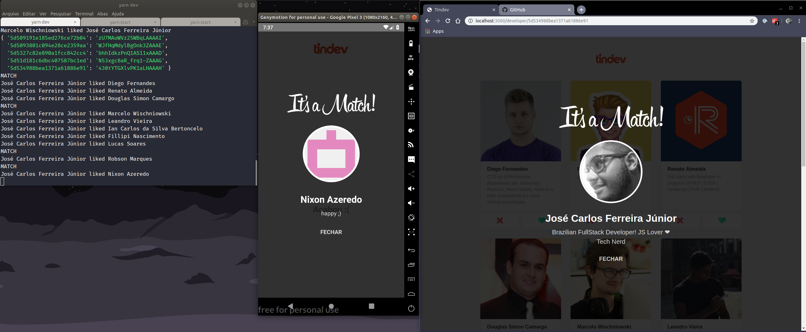

 

# TinDev

TinDev is a Tinder clone made by developers to developers. It's a way to find others developers to exchange knowledge and help each other.

## Images

 

## Installation

To use this repo you will need `nodejs@10.*` installed in yout machine.

### Backend

### Frontend

### Mobile

## Contributing
Pull requests are welcome. For major changes, please open an issue first to discuss what you would like to change.

Please make sure to update tests as appropriate.

## License
[MIT](https://choosealicense.com/licenses/mit/)
